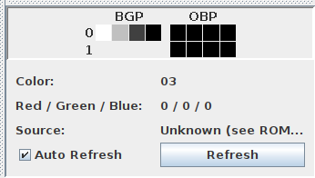

# Palettes

In the previous lesson, I briefly mentioned that colors are applied to tiles via *palettes*, but we haven't talked much about those yet.

The black & white Game Boy has three palettes, one for the background called [`BGP`](https://gbdev.io/pandocs/Palettes.html#ff47---bgp-bg-palette-data-rw---non-cgb-mode-only) ("BackGround Palette"), and two for the objects called [`OBP0`](https://gbdev.io/pandocs/Palettes.html#ff48---obp0-object-palette-0-data-rw---non-cgb-mode-only) and [`OBP1`](https://gbdev.io/pandocs/Palettes.html#ff48---obp1-object-palette-1-data-rw---non-cgb-mode-only) ("OBject Palette 0/1").
If you are wondering what "objects" are, you will have to wait until Part Ⅱ to find out; for now, let's focus on the background.

::: tip:🌈

The Game Boy Color introduced, obviously, colors, and this was mainly done by reworking the way palettes are handled.
We will not talk about Game Boy Color features in Part Ⅰ for the sake of simplicity, but we will do so in later parts.

:::

Please select the "Palettes" tab of BGB's VRAM viewer.



::: tip:🥴

The VRAM viewer's layout may seem weird.
As mentioned in the previous tip box, the Game Boy Color changed the way palettes work, and the Super Game Boy throws another wrench into the mix.

The VRAM viewer uses the same layout for monochrome and Color, leading to this admittedly strange layout.

:::

We will be taking a look at the "BGP" line.
As I explained before, tiles store "color indices" for each pixel, which are used to index into the palette.
Color number 0[^numbering_zero] is the leftmost in that line, and number 3 is the rightmost.

So, in our case, color number 0 is "white", color number 1 is "light gray", number 2 is "dark gray", and number 3 "black".
I put air quotes because "black" isn't true black, and "white" isn't true white.
Further, note that the original Game Boy had shades of green, but the later Game Boy Pocket's screen produced shades of gray instead.
And, even better, the Game Boy Color will automatically colorize games that lack Game Boy Color support!


All this to say, one shouldn't expect specific colors out of a Game Boy game[^console_detection], just four more or less bright colors.

## Getting our hands dirty

Well, so far in this tutorial, besides running the Hello World, we have been pretty passive, watching it unfold.
What do you say we start prodding the ROM a bit?

In BGB's debugger, select the "Window" menu, and open the "IO map" (or just press <kbd><kbd>F10</kbd></kbd> within the debugger).


While the VRAM viewer offers a visual representation of the palette, the IO map shows the nitty-gritty: how it's encoded.
The IO map also lets us modify BGP easily; but to do so, we need to understand *how* values we write are turned into colors.

### Encoding

Fortunately, the encoding is very simple.
I will explain it, and at the same time, give an example with the palette we have at hand, $E4.

Take the byte, break its 8 bits into 4 groups of 2.
```
[BGP] = $E4
$E4 = %11100100 (refresh your memory in the "Binary and hexadecimal" lesson if needed!)
That gets broken down into %11, %10, %01, %00
```

Color number 0 is the rightmost "group", color number 3 is the leftmost one.
Simple!
And this matches what the VRAM viewer is showing us: color number 0, the rightmost, is the brightest (%00), up to color number 3, the leftmost and the darkest (%11).

### Lights out

For fun, let's make the screen completely black.
We can easily do this by setting all colors in the palette to black (%11).
This would be `%11 %11 %11 %11 = $FF`.

In the IO map, click the text box left of "BGP", erase the "E4", type "FF", and hit Enter.
BGP immediately updates, turning the screen black!

<figure>
	
	<figcaption>Observe how the BGP line is entirely black now. Also, I could have shown a screenshot of the black screen, but that would have been silly.</figcaption>
</figure>

What if we wanted to take the original palette, but invert it?
%11 would become %00, %01 would become %10, %10 would become %01, and %00 would become %11.
We would get thus:

```
%11_10_01_00
 ↓  ↓  ↓  ↓
%00_01_10_11
```

(I'm not giving the value in hexadecimal, use this as an opportunity to exercise your bin-to-hex conversions!)

<figure>
	
	<figcaption>If you got it right, it should look like this!</figcaption>
</figure>

If you go to the Tile Viewer and uncheck the "show paletted" checkbox, you will notice that the tile data stays the same regardless of how the palette is modified!
This is an advantage of using palettes: fading the screen in and out is very cheap, just modifying a single byte, instead of having to update every single on-screen pixel.

Got all that?
Then let's take a look at the last missing puzzle piece in the Hello World's rendering process, the **tilemap**!

---

[^numbering_zero]:
Numbering often starts at 0 when working with computers.
We will understand why later, but for now, please bear with it!

[^console_detection]:
Well, it is possible to detect these different models and account for them, but this would require taking plenty of corner cases into consideration, so it's probably not worth the effort.
