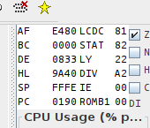

# Registers

Alright!
Now that we know what bits are, let's talk about how they're used.
Don't worry, this is mostly prep work for the next section, where we will—finally!—look at the code 👀

First, if you opened BGB, you have been greeted with just the Game Boy screen.
So, it's time we pop the debugger open!
Right-click the screen, select "Other", and click "Debugger".
Oh, and while we're at this, we might as well increase the screen size a little.

<video controls poster="../assets/vid/debugger.poster.png">
	<source src="../assets/vid/debugger.webm" type="video/webm">
	<source src="../assets/vid/debugger.mp4" type="video/mp4">

	
</video>

The debugger may look intimidating at first, but don't worry, soon we'll be very familiar with it!
For now, let's focus on this small box near the top-right, the *register viewer*.

::: warning:⚠️

The register viewer shows both *CPU registers* and some *hardware registers*.
This lesson will only deal with CPU registers, so that's why we will be ignoring some of these entries here.

:::

What are CPU registers?
Well, imagine you're preparing a cake.
You will be following a recipe, whose instructions may be "melt 125g of chocolate and 125g of butter, blend with 2 eggs" and so on.
You will fetch some ingredients from the fridge as needed, but you don't cook inside the fridge; for that, you have a small workspace.

Registers are pretty much the CPU's workspace.
They are small, tiny chunks of memory embedded directly in the CPU (only 10 bytes for the Game Boy's CPU, and even modern CPUs have less than a kilobyte if you don't count <a href="https://en.wikipedia.org/wiki/SIMD"><abbr title="Single Instruction, Multiple Data">SIMD</abbr></a> registers).
Operations are not performed directly on data stored in memory, which would be equivalent to breaking eggs directly inside our fridge, but they are performed on registers.

::: tip:ℹ️

There are exceptions to this rule, like many other "rules" I will give in this tutorial; I will paper over them to keep the mental complexity reasonable, but don't treat my word as gospel either.

:::

## General-purpose registers

CPU registers can be placed into two categories: *general-purpose* and *special-purpose*.
A "general-purpose" register (<abbr title="General-Purpose Register">GPR</abbr> for short) can be used for storing arbitrary integer numbers.
Some GPRs are special nonetheless, as we will see later; but the distinction is "can I store arbitrary integers in it?".

I won't introduce special-purpose registers quite yet, as their purpose wouldn't make sense yet.
Rather, they will be discussed as the relevant concepts are introduced.

The Game Boy CPU has seven 8-bit GPRs: `a`, `b`, `c`, `d`, `e`, `h`, and `l`.
"8-bit" means that, well, they store 8 bits.
Thus, they can store integers from 0 to 255 (%1111_1111 aka $FF).

`a` is the *accumulator*, and we will see later that it can be used in special ways.

A special feature is that these registers, besides `a`, are *paired up*, and the pairs can be treated as the 16-bit registers `bc`, `de`, and `hl`.
The pairs are *not* separate from the individual registers; for example, if `d` contains 192 ($C0) and `e` contains 222 ($DE), then `de` contains 49374 ($C0DE) = 192 × 256 + 222.
The other pairs work similarly.

Modifying `de` actually modifies both `d` and `e` at the same time, and modifying either individually also affects the pair.
How do we modify registers?
Let's see how, with our first assembly instructions!
