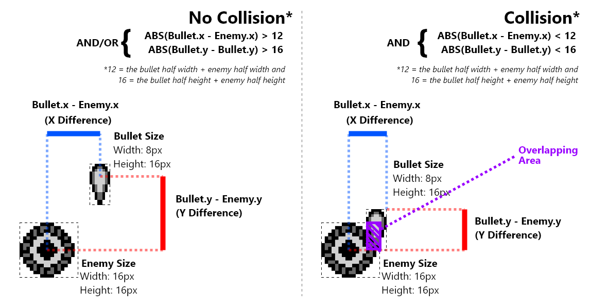

# Collision Detection

Collision Detection is crucial to games. It can be a very complicated topic. In Galactic Armada, things will be kept super simple. We're going to perform a basic implementation of "Axis-Aligned Bounding Box Collision Detection". From Mozilla, Axis-Aligned Bounding Box Collision Detection is:

> One of the simpler forms of collision detection is between two rectangles that are axis aligned — meaning no rotation. The algorithm works by ensuring there is no gap between any of the 4 sides of the rectangles. Any gap means a collision does not exist.

The easiest way to check for overlap, is to check the difference bewteen their centers. If the absolute value of their x & y differences (I'll refer to as "the absolute difference") are BOTH smaller than the sum of their half widths, we have a collision. This collision detection is run for bullets against enemies, and enemies against the player. Here's a visualization with bullets and enemies.



For this, we've created a basic function called "CheckObjectPositionDifference". This function will help us check for overlap on the x or y axis. When the (absolute) difference between the first two values passed is greater than the third value passed, it jump's to the label passed in the fourth parameter.

Here's an example of how to call this function:

> We have the player's x & y position in registers d & e respectively. We have the enemy's x & y position in registers b & c respectively. If there is no overlap on the x or y axis, the program jumps to the "NoCollisionWithPlayer" label.

```rgbasm,linenos,start={{#line_no_of "" ../../galactic-armada/main.asm:player-collision-label}}
{{#include ../../galactic-armada/main.asm:player-collision-label}}
```

We use that function twice. Once for the x-axis, and again for the y-axis.

> NOTE: We don't need to test the y-axis if the x-axis fails. 