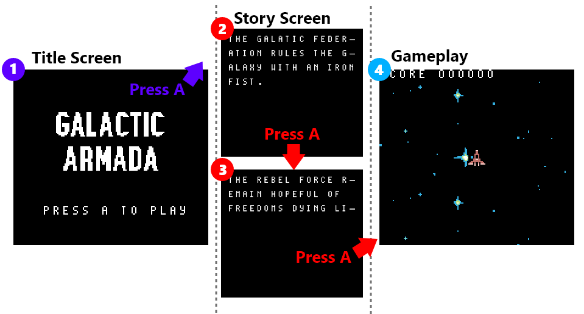

# Changing Game States

In our [GalacticArmada.asm](https://github.com/gbdev/gb-asm-tutorial/blob/master/galactic-armada/src/main/GalacticArmada.asm) file, we'll define label called "NextGameState". Our game will have 3 game states:

- Title Screen
- Story Screen
- Gameplay

Here is how they will flow:



This page will show you how to setup basic game state management. For organization, we'll put our game state management code inside of a new file.

**Create "game-state-management.asm" right next to the entrypoint "GalacticArmada.asm"**
## Setting up Game State Management

First thing we'll do in our new "game-state-management.asm" file is setup 3 variables in working ram. 
- **wCurrentGameState_Update** - the address of the current game state's update function
- **wNextGameState_Initiate** - If we are changing game states, this will be non-zero. In that case, it will be the address of the "initiate" function for that game state.
- **wNextGameState_Update** - If we are changing game states, this will be non-zero. In that case, it will be the address of the "update" function for that game state. It will overwrite the `wCurrentGameState_Update` variable after the above `wNextGameState_Initiate` is called.

**Create those 3 variables as "words" at the top of our game-state-management.asm file, in the working ram section titled "GameStateManagementVariables":**

> **Note:** See the RGBDS page on ["Defining Data"](https://rgbds.gbdev.io/docs/v0.6.1/rgbasm.5#DEFINING_DATA) for more information about variable types.

```rgbasm, linenos,start={{#line_no_of "" ../../galactic-armada/src/main/game-state-management.asm:game-state-variables}}
{{#include ../../galactic-armada/src/main/game-state-management.asm:game-state-variables}}
```

**Next, create a function called `InitializeGameStateManagement`.** This function should go inside of a section called "GameStateManagement", and be exported. See [here](https://rgbds.gbdev.io/docs/v0.6.1/rgbasm.5#Labels) for more information about exporting.

In this function we'll default all of our game state variables to 0.

```rgbasm, linenos

SECTION "GameStateManagement", ROM0

InitializeGameStateManagment::
	
	; Default our game state variables
	ld a, 0
	ld [wCurrentGameState_Update+0], a
	ld [wCurrentGameState_Update+1], a
	ld [wNextGameState_Initiate+0], a
	ld [wNextGameState_Initiate+1], a
	ld [wNextGameState_Update+0], a
	ld [wNextGameState_Update+1], a

    ret
```

If we return back to our GalacticArmada.asm file, we'll put in a call to our new `InitializeGameStateManagement` function. This function call will go right before our game loop:
```rgbasm, linenos
    ; Inside of GalacticArmada.asm
	; ... Previous "EntryPoint" logic

	call InitializeGameStateManagment

GalacticArmadaGameLoop:
```

Now we have to setup and implement those variables. To do that, we'll create the following functions: 
- **InitiateNewGameStates** - This will initialize the new game state, if we are changing game states.
- **UpdateCurrentGameState** - This will update the current game state, if it exists.
### Initiate New Game States

We previously created a `wNextGameState_Initiate` variable. This variable will be used to hold an address. That address will point to the initiation logic for the next game state. If this variable is 0, then the game is NOT changing game states. If the variable is NOT 0, then we'll call the function it specifies.

After we've called that initiate function, we'll update our `wCurrentGameState_Update` variable. We'll override it's current value, with the value specified in our other variable: `wNextGameState_Update`. This will tell the game to start calling the new game state's update logic instead of our curernt/old one.

With those changes done, we'll reset our `wNextGameState_Initiate` and `wNextGameState_Update` variables back to 0. This will prevent the initiation logic from executing again until we change the game state.

**Create this function at the bottom of the game-state-management.asm file:**

```rgbasm,linenos,start={{#line_no_of "" ../../galactic-armada/src/main/game-state-management.asm:initiate-new-game-state-function}}
{{#include ../../galactic-armada/src/main/game-state-management.asm:initiate-new-game-state-function}}
```

> **Note:** The `callHL` function will already be included in the starter. It simply provides an easy way to jump to dynamic addresses and return afterwards.
### Updating the current Game State

For updating the current game state, we'll get the address in our `wCurrentGameState_Update` variable. If it's 0, we'll return early. Otherwise, we'll call the function located at that address and return when the function is done.

**Create this function at the bottom of the game-state-management.asm file:**

```rgbasm,linenos,start={{#line_no_of "" ../../galactic-armada/src/main/game-state-management.asm:update-current-game-state-function}}
{{#include ../../galactic-armada/src/main/game-state-management.asm:update-current-game-state-function}}
```
## Adding Game State Management to our Game Loop

Now that we have created our `InitiateNewCurrentGameState` and `UpdateCurrentGameState` functions, we can implement them

**Go back to our "GalacticArmada.asm" file. In the `GalacticArmadaGameLoop` function, (after we call `ResetShadowOAM`) add calls to those 2 functions**

```rgbasm, linenos
; Inside of GalacticArmada.asm
GalacticArmadaGameLoop:

	; ... existing logic calling 'Input' and `ResetShadowOAM`

{{#include ../../galactic-armada/src/main/GalacticArmada.asm:update-game-state-management}}

    ; ... existing logic waiting for VBlank start, before calling `hOAMDMA` and looping.
```

That wraps up game state management for now. We've got one more thing to do, setup a default game state. That task won't be done yet. 

In the next page, you'll create the title screen. Once we've fully setup that game state, we'll come back to the GalacticArmada.asm file and specify it as our default game state.