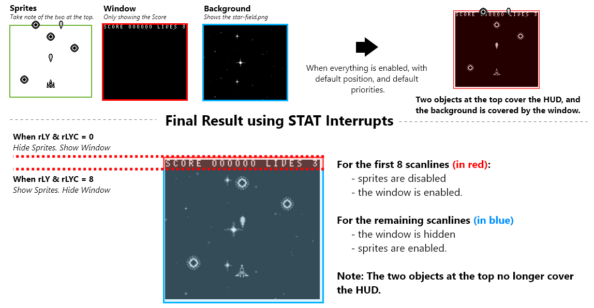

# Top HUD

The gameboy normally draws sprites over both the window and background, and the window over the background. In Galactic Armada, The background is vertically scrolling. This means the HUD (the score text and number) needs to be draw on the window, which is separate from the background. 

The window is not enabled by default. We can enable the window using the `LCDC` register. RGBDS comes with constants that will help us. Here's how we did that in code:

```rgbasm,linenos,start={{#line_no_of "" ../../galactic-armada/main.asm:turn-on-lcd}}
{{#include ../../galactic-armada/main.asm:turn-on-lcd}}
```

> ⚠️ NOTE: The window can essentially be a copy of the background. The `LCDCF_WIN9C00|LCDCF_BG9800` portion makes the background and window use different tilemaps when drawn.

There’s only one problem. Since the window is drawn between sprites and the background. Without any extra effort, our scrolling background tilemap will be covered by our window. In addition, our sprites will be drawn over our hud. For this, we’ll need STAT interrupts. Fore more information on STAT interrupts, check out the pandocs: [https://gbdev.io/pandocs/Interrupt_Sources.html](https://gbdev.io/pandocs/Interrupt_Sources.html)




> ### **[Using the STAT interrupt](https://gbdev.io/pandocs/Interrupt_Sources.html#using-the-stat-interrupt)**
> 
> One very popular use is to indicate to the user when the video hardware is about to redraw a given LCD line. This can be useful for dynamically controlling the SCX/SCY registers ($FF43/$FF42) to [perform special video effects](https://github.com/gb-archive/DeadCScroll).
> 
> Example application: set LYC to WY, enable LY=LYC interrupt, and have the handler disable sprites. This can be used if you use the window for a text box (at the bottom of the screen), and you want sprites to be hidden by the text box.


With STAT interrupts, we can implement raster effects. in our case, we’ll enable the window and stop drawing sprites on the first 8 scanlines. Afterwards, we’ll show sprites and disable the window layer for the remaining scanlines. This makes sure nothing overlaps our HUD, and that our background is fully shown also.

STAT interrupts must be located at $0048. Here is how the code for that looks;

```rgbasm,linenos,start={{#line_no_of "" ../../galactic-armada/main.asm:stat-interrupt}}
{{#include ../../galactic-armada/main.asm:stat-interrupt}}
```

 We can enable stat interrupts like so:

```rgbasm,linenos,start={{#line_no_of "" ../../galactic-armada/main.asm:init-stat-interrupt}}
{{#include ../../galactic-armada/main.asm:init-stat-interrupt}}
```


That should be all it takes to get a properly drawn HUD. For more details, check out the code in the repo or [ask questions](https://gbdev.io/gb-asm-tutorial/help-feedback.html) on the gbdev discord server. With that done, We can draw text on the window similar to how we drew text on the title screen, just passing a different address.

```rgbasm,linenos,start={{#line_no_of "" ../../galactic-armada/main.asm:draw-score-text}}
{{#include ../../galactic-armada/main.asm:draw-score-text}}
```

For drawing numbers, things are a little different. 