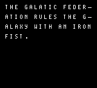
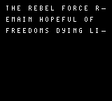

# Story Screen

The story screen shows a basic story on 2 pages. Afterwards, it sends the player to the gameplay game state.




## Initiating up the Story Screen

In the "InitStoryState" we'll just going to turn on the LCD. Most of the game state's logic will occur in its update function.

> **NOTE:** The text macros file is included so our story text has the proper character maps.

```rgbasm,linenos,start={{#line_no_of "" ../../galactic-armada/src/main/states/story/story-state.asm:init-story-state}}
{{#include ../../galactic-armada/src/main/states/story/story-state.asm:init-story-state}}
```

## Updating the Story Screen

Here's the data for our story screen. We have this defined just above our "UpdateStoryState" function:

```rgbasm,linenos,start={{#line_no_of "" ../../galactic-armada/src/main/states/story/story-state.asm:story-screen-data}}
{{#include ../../galactic-armada/src/main/states/story/story-state.asm:story-screen-data}}
```

The story text is shown using a typewriter effect. This effect is done similarly to the “press a to play” text that was done before, but here we wait for 3 vertical blank phases between writing each letter, giving some additional delay.

> You could bind this to a variable and make it configurable via an options screen too!

For this effect, we've defined a function in our "src/main/utils/text-utils.asm" file:

```rgbasm,linenos,start={{#line_no_of "" ../../galactic-armada/src/main/utils/text-utils.asm:typewriter-effect}}
{{#include ../../galactic-armada/src/main/utils/text-utils.asm:typewriter-effect}}
```

We'll use the "DrawText_WithTypewriterEffect" function by setting these registers:
* in de: what background tilemap address we want to start writing letters at
* in hl: the address to the start of the current line

We'll do that four times for the first page, and then wait for the A button to be pressed:

```rgbasm,linenos,start={{#line_no_of "" ../../galactic-armada/src/main/states/story/story-state.asm:story-screen-page1}}
{{#include ../../galactic-armada/src/main/states/story/story-state.asm:story-screen-page1}}
```
Once the user presses the A button, we want to show the second page. To avoid any lingering "leftover" letters, we'll clear the background. All this function does is turn off the LCD, fill our background tilemap with the first tile, then turn back on the lcd. We've defined this function in the "src/main/utils/background.utils.asm" file:

```rgbasm,linenos,start={{#line_no_of "" ../../galactic-armada/src/main/utils/background-utils.asm:background-utils}}
{{#include ../../galactic-armada/src/main/utils/background-utils.asm:background-utils}}
```

Getting back to our Story Screen: After we've shown the first page and cleared the background, we'll do the same thing for page 2:

```rgbasm,linenos,start={{#line_no_of "" ../../galactic-armada/src/main/states/story/story-state.asm:story-screen-page2}}
{{#include ../../galactic-armada/src/main/states/story/story-state.asm:story-screen-page2}}
```

With our story full shown, we're ready to move onto the next game state: Gameplay. We'll end our "UpdateStoryState" function by updating our game state variable and jump back to the "NextGameState" label like previously discussed.

```rgbasm,linenos,start={{#line_no_of "" ../../galactic-armada/src/main/states/story/story-state.asm:story-screen-end}}
{{#include ../../galactic-armada/src/main/states/story/story-state.asm:story-screen-end}}
```
