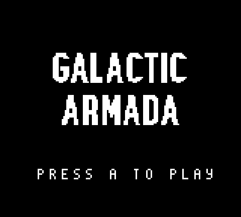

# Title Screen

The title screen shows a basic title image using the background, and draws text for the user to press A. Once the user presses A, it will go to the story screen.



The “Press a to play” text not only rhymes, but is also not a part of the “title-screen.png” this is from the “text-font.png”. A helper function was created to draw text from the text-font onto the background. 

```rgbasm,linenos,start={{#line_no_of "" ../../galactic-armada/main.asm:draw-text-tiles}}
{{#include ../../galactic-armada/main.asm:draw-text-tiles}}
```

It draws until it reads a value of 255 (so we can use 0’s as spaces). A helper macro is used to make that function easy to call. 

```rgbasm,linenos,start={{#line_no_of "" ../../galactic-armada/main.asm:draw-text}}
{{#include ../../galactic-armada/main.asm:draw-text}}
```

With that macro created. Defining and Drawing the ‘press a to play’ at the background tilemap tile $99C3, is an easy task:

```rgbasm,linenos,start={{#line_no_of "" ../../galactic-armada/main.asm:draw-press-play}}
{{#include ../../galactic-armada/main.asm:draw-press-play}}
```

One important thing to note. Character maps for each letter must be defined. This let’s RGBDS know what byte value to give a specific letter.

For the Galactic Armada space mapping, we’re going off the “text-font.png” image. Our space character is the first character in VRAM. Our alphabet starts at 26. Special additions could be added if desired. For now, this is all that we’ll need.

```rgbasm,linenos,start={{#line_no_of "" ../../galactic-armada/main.asm:charmap}}
{{#include ../../galactic-armada/main.asm:charmap}}
```