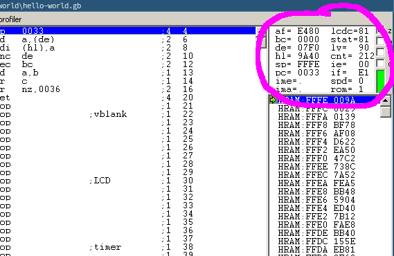

# Registers

Bene!
Ora che sappiamo cosa sono i bit, cerchiamo di capire come si usano.
Non ti preoccupare, tutto questo è per lo più in preparazione alla prossima parte, dove ci butteremo finalmente nel vero e proprio codice 👀

Per iniziare, se hai già provato ad aprire BGB ti sarà comparso solo lo schermo del GameBoy.
Ora è il momento di aprire il debugger!
Apri il menu facendo clic destro sullo schermo, vai su "Other", e scegli "Debugger".
E già che ci siamo, aumentiamo un po' la dimensione della finestra.

<video controls poster="../assets/vid/debugger.poster.png">
	<source src="../assets/vid/debugger.webm" type="video/webm">
	<source src="../assets/vid/debugger.mp4" type="video/mp4">

	
</video>

Il debugger potrebbe sembrare incomprensibile all'inizio, ma non ti preoccupare: ti ci abituerai in fretta!
Per il momento guarda in alto a destra, dove c'è un piccolo spazio chiamato _register viewer_ (visualizzatore dei registri).

::: warning:⚠️

Il visualizzatore mostra sia i _registri della CPU_ che alcuni _registri hardware_.
In questa lezione parleremo solo dei registri della CPU, perciò non ti preoccupare se non menzioniamo alcuni dei nomi.

:::

Ma cosa sono questi registri della CPU?
Ti faccio un esempio: immagina di star preparando una torta.
Ovviamente avrai una ricetta da seguire, come ad esempio "sciogli 125g di cioccolato e 125g di burro, mescola il tutto con due uova" e così via.
Dopo aver preso gli ingredienti, non li usi direttamente nel frigo; per comodità, li prenderai e li metterai su un tavolo dove lavorarci più facilmente.

I registri sono questo tavolo, su cui la CPU poggia temporaneamente i suoi ingredienti.
Più concretamente, sono dei piccoli spazi di memoria (Il GameBoy ne ha solo 10 byte, e anche le CPU moderne hanno meno di un kilobyte se non si contano i registri <a href="https://it.wikipedia.org/wiki/SIMD"><abbr title="Single Instruction, Multiple Data">SIMD</abbr></a>).
Eseguire le operazioni direttamente sulla memoria è scomodo, sarebbe come rompere le uova nel frigo: per questo le spostiamo sul tavolo, i registri, prima di romperle.

::: tip:ℹ️

Ovviamente ci sono eccezioni a questa regola, come un po' tutte le regole che ti spiegheremo nel tutorial; stiamo semplificando di molto le cose per mantenerle ad un livello abbastanza facile da comprendere, perciò non prendere mai queste regole troppo alla lettera.

:::

## General-purpose registers

CPU registers can be placed into two categories: *general-purpose* and *special-purpose*.
A "general-purpose" register (<abbr title="General-Purpose Register">GPR</abbr> for short) can be used for storing arbitrary data.
Some GPRs are special nonetheless, as we will see later; but the distinction is "can I store arbitrary data in it?".

I won't introduce special-purpose registers quite yet, as their purpose wouldn't make sense yet.
Rather, they will be discussed as the relevant concepts are introduced.

The Game Boy CPU has seven 8-bit GPRs: `a`, `b`, `c`, `d`, `e`, `h`, and `l`.
"8-bit" means that, well, they store 8 bits.
Thus, they can store integers from 0 to 255 (%1111_1111 aka $FF).

`a` is the *accumulator*, and we will see later that it can be used in special ways.

A special feature is that these registers, besides `a`, are *paired up*, and the pairs can be treated as the 16-bit registers `bc`, `de`, and `hl`.
The pairs are *not* separate from the individual registers; for example, if `d` contains 192 ($C0) and `e` contains 222 ($DE), then `de` contains 49374 ($C0DE) = 192 × 256 + 222.
The other pairs work similarly.

Modifying `de` actually modifies both `d` and `e` at the same time, and modifying either individually also affects the pair.
How do we modify registers?
Let's see how, with our first assembly instructions!
